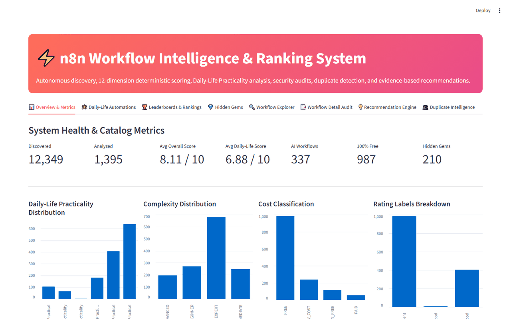

# n8n Workflow Intelligence & Ranking System

<p align="center">
  
  
  
  
  
</p>

> **An autonomous, evidence-based intelligence and ranking system for n8n workflow templates.** Discovers, crawls, analyzes, scores (12 dimensions), deduplicates, and ranks workflows from [n8n.io](https://n8n.io/workflows/) — with an interactive Streamlit dashboard and FastAPI REST API.

---

<p align="center">
  <b>⬇️ See it in action — the live dashboard: metrics, leaderboards, and filtering</b><br><br>
  
</p>

---

## 📋 Table of Contents
- [🧩 Problem Solved](#-problem-solved)
- [🚀 Use Cases](#-use-cases)
- [⚡ Quick Demo](#-quick-demo)
- [✨ Key Capabilities](#-key-capabilities)
- [📂 Project Structure](#-project-structure)
- [🛠️ Installation & Setup](#️-installation--setup)
- [💻 Running the System](#-running-the-system)
- [📊 Database Schema](#-database-schema)
- [🤝 Contributing](#-contributing)

---

## 🧩 Problem Solved

The official n8n template library has **thousands of workflows** — but no quality ranking system. Finding a reliable, well-designed automation that actually solves your problem is like finding a needle in a haystack.

This project solves:
1. **Find Quality Workflows** — Discover templates that are actually reliable and practical, not just popular.
2. **Assess Security & Reliability** — Automatically flag workflows with hardcoded secrets, dangerous `eval()` calls, or insecure webhooks.
3. **Understand Complexity & Cost** — Instantly distinguish between free/low-cost "quick wins" and complex enterprise integrations.
4. **Identify Duplicates/Variants** — Filter out repetitive templates to find original, high-value automation patterns.

---

## 🚀 Use Cases

| User | How They Benefit |
|------|-----------------|
| **Enterprise Security Teams** | Auto-audit templates pre-deployment for secrets and dangerous patterns |
| **n8n Power Users** | Discover "hidden gem" workflows with high reliability and low complexity |
| **Consultants & Agencies** | Compare workflow solutions for clients by cost footprint and estimated time savings |
| **Automation Builders** | Search templates scored across 12 dimensions — design quality, reusability, maintenance |

---

## ⚡ Quick Demo

Get started and see ranking results in under 60 seconds:

```bash
# 1. Install dependencies
pip install -r requirements.txt

# 2. Run the pipeline on 5 sample workflows
python -m agents.supervisor --limit 5

# 3. Launch the interactive dashboard
streamlit run dashboard/app.py
```

> **No external services needed.** The default config runs fully offline with deterministic scoring. Works out of the box.

---

## ✨ Key Capabilities

| Category | Features |
|----------|----------|
| **🔍 Discovery** | Automatically finds templates via official sitemaps and search APIs |
| **🤖 Crawler** | Polite crawling with token bucket rate limiting, disk caching, and retry backoff |
| **🧬 Graph Extraction** | Parses node types, triggers, connections, AI components, credentials, databases |
| **🏷️ Classification** | Complexity (Beginner→Expert), Cost (Free→Expensive), Security audit |
| **📊 12-Dimension Scoring** | Practical usefulness, automation value, design quality, reliability, setup ease, reusability, documentation, integrations, security, maintenance, cost efficiency |
| **🔗 Duplicate Detection** | Exact hash + structural fingerprint + semantic Jaccard similarity |
| **🏆 Leaderboards** | 18+ auto-generated categories — Top AI Agents, Best Free, Hidden Gems, etc. |
| **💬 Recommendation Engine** | Natural language query engine backed by database evidence |
| **🖥️ Interactive Dashboard** | Full Streamlit GUI for browsing, filtering, and ranking workflows |
| **🔄 Incremental Updates** | Continuous monitoring with change detection and version history |

---

## 📂 Project Structure

```
n8n-workflow-ranker/
│
├── agents/                      # Autonomous Agents Pipeline
│   ├── supervisor.py            # End-to-end pipeline orchestrator
│   ├── discovery.py             # Discovers templates from sitemaps & search
│   ├── crawler.py               # Polite batch crawler
│   ├── extractor.py             # Normalization and database extraction
│   ├── analyst.py               # Complexity, cost, and usefulness analysis
│   ├── security.py              # Security review and finding generation
│   ├── scorer.py                # 12-dimension scoring and persistence
│   ├── deduplicator.py          # Multi-layer duplicate detection
│   ├── ranking.py               # Generates and caches leaderboards
│   ├── updater.py               # Incremental monitoring and versioning
│   └── recommendation.py       # Natural language query engine
│
├── crawler/                     # Low-Level Crawling Infrastructure
│   ├── client.py                # HTTP client with retry, backoff, disk cache
│   ├── discovery_sources.py     # Sitemap XML and Search API parser
│   ├── workflow_page.py         # Full workflow JSON fetcher
│   └── rate_limiter.py          # Token bucket rate limiter
│
├── extraction/                  # Extraction & Normalization
│   ├── metadata.py              # Top-level template metadata
│   ├── workflow_json.py         # Node graph, connections, credentials
│   └── normalization.py         # Type aliases and fingerprint hashes
│
├── analysis/                    # Specialized Analyzers
│   ├── complexity.py            # Complexity classification (Beginner to Expert)
│   ├── cost.py                  # Paid vs Free dependencies & cost notes
│   ├── security.py              # Embedded secrets & vulnerability scanner
│   └── usefulness.py            # Business domain & time saved
│
├── scoring/                     # Scoring Rubric & Metrics
│   ├── rubric.yaml              # Weights and rating label bounds
│   ├── penalties.yaml           # Penalty rules and deductions
│   ├── score.py                 # 12-criterion deterministic score engine
│   ├── confidence.py            # 0-100% evidence completeness score
│   ├── ai_capability.py         # 0-10 AI agent capability score
│   └── value_gem.py             # Value Score and Hidden Gem Score
│
├── database/                    # SQLite Storage & Models
│   ├── schema.sql               # PostgreSQL-compatible SQL schema
│   ├── db.py                    # Connection manager, transactions, WAL mode
│   └── models.py                # Pydantic data models
│
├── embeddings/                  # Similarity & Deduplication
│   └── similarity.py            # Multi-layer duplicate detection
│
├── ai/                          # AI Provider Layer
│   └── provider.py              # OpenAI-compatible API abstraction
│
├── dashboard/                   # Streamlit GUI
│   └── app.py                   # Interactive web dashboard
│
├── api/                         # FastAPI Internal API
│   └── app.py                   # REST endpoints
│
├── tests/                       # Pytest Test Suite
│   ├── conftest.py              # Shared fixtures and mock workflows
│   ├── test_discovery.py
│   ├── test_extraction.py
│   ├── test_analysis.py
│   ├── test_scoring.py
│   └── test_database.py
│
├── data/                        # Local Storage (gitignored)
│   ├── raw/                     # Raw JSON payloads
│   ├── normalized/              # Clean normalized workflow JSON
│   ├── cache/                   # HTTP response disk cache
│   └── n8n_workflows.db         # SQLite database
│
├── config.yaml                  # System configuration
├── .env.example                 # Environment template
├── requirements.txt             # Python dependencies
├── CONTRIBUTING.md              # Contribution guidelines
└── README.md                    # This file
```

---

## 🛠️ Installation & Setup

**Prerequisites:** Python 3.11+

### 1. Install Dependencies
```bash
pip install -r requirements.txt
```

### 2. Configure Environment (Optional)
The default configuration works out of the box. To enable AI-assisted scoring via a local LLM endpoint:

```env
AI_PROVIDER=openai_compatible
AI_BASE_URL=http://127.0.0.1:20128/v1
ENABLE_AI_SCORING=false
```

---

## 💻 Running the System

### 🏃 Complete Pipeline (20 Workflows)
```bash
python -m agents.supervisor --limit 20
```

### 🖥️ Interactive Dashboard
```bash
streamlit run dashboard/app.py
```

### 🔄 Incremental Update Cycle
```bash
python -m agents.updater
```

### 🧪 Run Tests
```bash
python -m pytest -v
```

### 🌐 FastAPI Backend
```bash
uvicorn api.app:app --reload --port 8000
```

---

## 📊 Database Schema

13 relational tables in a single SQLite database (`data/n8n_workflows.db`):

| Table | Purpose |
|-------|---------|
| `discovery_records` | Discovered URLs, sources, crawl status |
| `workflows` | Main catalog — scores, complexity, cost, security, hashes |
| `workflow_nodes` | Extracted nodes, triggers, AI flags, credentials |
| `workflow_integrations` | Connected apps and services |
| `workflow_categories` | Taxonomy categories |
| `score_evidence` | 12-dimension breakdown with exact evidence |
| `penalties` | Deductions with cited evidence |
| `security_findings` | Static audit findings with severity |
| `duplicates` | Multi-layer duplicate and variant links |
| `rankings` | Cached category leaderboards |
| `workflow_versions` | Historical snapshots for change detection |
| `crawl_runs` | Crawl session execution logs |
| `crawl_errors` | Failed URL error queue |

---

## 🤝 Contributing

Contributions are welcome! See [CONTRIBUTING.md](CONTRIBUTING.md) to get started.

---

<p align="center">
  <b>Built with ❤️ for the n8n community</b><br>
  <a href="https://github.com/harryin09-labs/n8n-workflow-ranker">⭐ Star on GitHub</a> •
  <a href="https://github.com/harryin09-labs/n8n-workflow-ranker/issues">🐛 Report a Bug</a> •
  <a href="https://github.com/harryin09-labs/n8n-workflow-ranker/discussions">💬 Start a Discussion</a>
</p>